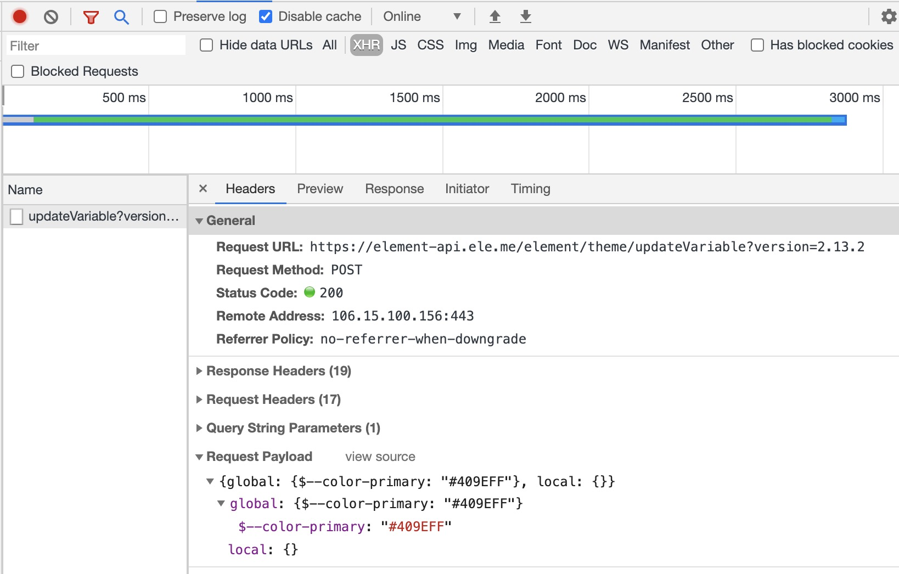

### Element-ui 如何自定义主题
> `element-ui`是一款很优秀的ui组件库，为开发者提供了很大的便利。我们在使用他的同时有时候也要看看其中的实现原理；最近做了一个更换系统主题的需求，所以就一探究竟；
- element-ui官方提供更换主题的四种方法
1. 主题编辑器<br/>
Element团队为我们提供了一个在线主题编辑器，我们只要在这个编辑器上面进行各个主题的定制即可，然后可以下载自定义后的主题css样式文件，引入到项目中即可；


2. 仅替换主题色<br/>
这个是`element`团队提供的一种在线替换主题色的一种方法；也是这次我这次需求所采用的一种方法；具体的[预览地址](https://elementui.github.io/theme-chalk-preview/#/zh-CN);

3. 在项目中改变 SCSS 变量<br/>
`element`的样式采用的是sass进行编写，其中`theme-chalk/src/common/var.scss`就是所有的样式变量；我们可以直接自己写一个`var-self.scss`文件,然后引入就好：
```css
/* 改变主题色变量 */
$--color-primary: teal;
/* 改变 icon 字体路径变量，必需 */
$--font-path: '~element-ui/lib/theme-chalk/fonts';
@import "~element-ui/packages/theme-chalk/src/index";
```
4. 命令行主题工具

- 探究实现原理 <br/>
`element`中做的事情其实就是对css文本中的颜色变量进行了全局替换；然后将替换后的css样式文本进行了手动插入到了head标签中；那么我们来看下是如何实际操作的吧；
1. 首先我们有一个颜色变量映射表，然后颜色变量进行变量替换；
```js
getStyleTemplate (data) {
    const colorMap = {
    '#3a8ee6': 'shade-1',
    '#409eff': 'primary',
    '#53a8ff': 'light-1',
    '#66b1ff': 'light-2',
    '#79bbff': 'light-3',
    '#8cc5ff': 'light-4',
    '#a0cfff': 'light-5',
    '#b3d8ff': 'light-6',
    '#c6e2ff': 'light-7',
    '#d9ecff': 'light-8',
    '#ecf5ff': 'light-9'
    }
    Object.keys(colorMap).forEach(key => {
    const value = colorMap[key]
    data = data.replace(new RegExp(key, 'ig'), value)
    })
    return data
}

// 将
".el-pagination button:hover{color:#409eff}.el-pagination__sizes .el-input .el-input__inner:hover{border-color:#409eff}.el-pagination.is-background .el-pager li:not(.disabled):hover{color:#409eff}..."
//替换成
".el-pagination button:hover{color:primary}.el-pagination__sizes .el-input .el-input__inner:hover{border-color:primary}.el-pagination.is-background .el-pager li:not(.disabled):hover{color:primary}..."
```
2. 生成新的样式表进行插入
```js
writeNewStyle () {
    let cssText = this.originalStyle
        Object.keys(this.colors).forEach(key => {
        cssText = cssText.replace(new RegExp(`(:|\\s+)${key}`, 'g'), `$1${this.colors[key]}`)
    })
    let style = document.getElementById('ele-theme');
    if (!style) {
        style = document.createElement('style');
        style.type = 'text/css';
        style.id = 'ele-theme';
        style.innerText = cssText;
        document.head.appendChild(style);
    } else {
        style.innerText = cssText;
    }
}
```
这段逻辑也是比较简单，就是把替换好的cssText进行颜色的替换以及插入到head中；如果没有则添加，有则进行替换；一些自定义的样式也可以通过这样的方式进行替换；<br/>
3. 在线编编辑的主题原理<br/>
这个需要我们跟server进行交互；我们可以看下在线编辑后的发送请求：


server应该会存有一份带有变量的css文本，我们一旦修改了哪个颜色值，只需要提交对应的变量以及修改后的颜色即可，然后server返回一个更新后的css文本给到我们；
<br/>以上就是这次的分享内容了
- 项目地址<br/>
[element-theme-chalk-preview](https://github.com/ElementUI/theme-chalk-preview)


